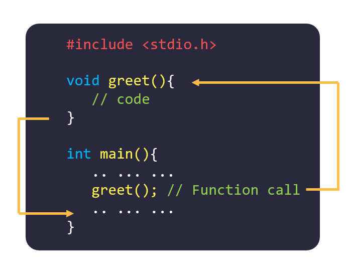

# Hàm - Functions

---

## 1. Định nghĩa Hàm

- Hàm (function) là một khối lệnh có nhiệm vụ thực hiện một chức năng nào đó.

- Có hai loại hàm thường gặp: Hàm của các thư viện có sẵn và Hàm được định nghĩa bởi người dùng.

**Lợi ích** của Hàm:

- Code trở nên mạch lạc, dễ đọc.
- Dễ debug khi gặp lỗi.
- Dễ bảo trì khi cần thay đổi một chức năng nhỏ.
- Có khả năng tái sử dụng lại code.

- Cú pháp:

```cpp
    data_type function_name(type1 parameter1, type2 parameter2...){
        //code
    }
```

- Các thành phần của hàm:

  - **data_type** : Kiểu trả về của hàm, có thể là các kiểu dữ liệu như `int`, `long long`, `float`, `char`, `double`, hoặc `void` (tương ứng với kiểu trả về là rỗng)
  - **function_name** : Tên của hàm, cần tuân theo quy tắc như đặt tên biến
  - **parameter** : Tham số của hàm, đây được coi như đầu vào của hàm. Bạn có thể xây dựng bao nhiêu tham số tùy ý và lựa chọn kiểu dữ liệu cho từng tham số.
  - **code** : Các câu lệnh bên trong của hàm.

- Ví dụ 1: Hàm có kiểu trả về là int, có 3 tham số là a, b, c

```cpp
    int tong(int a, int b, int c){
        int sum = a + b + c;
        return sum;
    }
```

- Ví dụ 2: Hàm có kiểu trả về là void, có 3 tham số là a kiểu `int`, b kiểu `long long`, c kiểu `double`:

```cpp
    void display(int a, long long b, double c){
        printf("%d %lld %.2lf\n", a, b, c);
    }
```

---

## 2. Gọi Hàm

- Sau khi xây dựng xong hàm, để hàm có thể thực thi, bạn cần:

  - **Gọi hàm trong hàm main**: Thực hiện điều này bằng cách viết tên hàm và truyền tham số (nếu cần).
  - **Thực thi các câu lệnh trong hàm**: Khi gọi hàm, chương trình sẽ thực hiện lần lượt từng câu lệnh trong hàm đó. Sau khi thực thi xong, hàm sẽ kết thúc và chương trình tiếp tục thực hiện các câu lệnh bên dưới trong hàm `main`.

- Cách thức hoạt động:
  - **Mỗi lần gọi hàm**, các câu lệnh trong hàm sẽ được thực hiện độc lập.
  - **Kết thúc hàm**, chương trình quay lại vị trí sau lệnh gọi hàm trong `main`.
  - Việc gọi hàm có thể lặp lại nhiều lần, giúp tái sử dụng mã nguồn và tăng tính hiệu quả.



- Ví dụ minh hoạ: Tính tổng hai số

```cpp
#include <stdio.h>

// Định nghĩa hàm tính tổng
int sum(int a, int b) {
    return a + b;
}

int main() {
    int x = 5, y = 10;
    printf("Trước khi gọi hàm\n");

    // Gọi hàm sum và lưu kết quả vào biến result
    int result = sum(x, y);
    printf("Tổng của %d và %d là: %d\n", x, y, result);

    printf("Sau khi gọi hàm\n");
    return 0;
}
Output:
Trước khi gọi hàm
Tổng của 5 và 10 là: 15
Sau khi gọi hàm
```

- Giải thích:
  - **Bước 1**:
    - Chương trình bắt đầu thực hiện từ hàm main.
    - Hai biến x và y được khai báo và khởi tạo với giá trị lần lượt là 5 và 10.
  - **Bước 2**:
    - Dòng lệnh sau được thực hiện:
    ```cpp
    printf("Trước khi gọi hàm\n");
    ```
    Kết quả: In ra dòng chữ "Trước khi gọi hàm".
  - **Bước 3**:
    - Lời gọi hàm sum được thực hiện:
    ```cpp
    int result = sum(x, y);
    ```
    - Chương trình nhảy đến hàm sum và truyền giá trị của x và y (5 và 10) vào các tham số tương ứng a và b.
    - Hàm sum thực hiện phép cộng:
    ```cpp
    return a + b;
    ```
    Kết quả trả về: 15.
  - **Bước 4**:
    - Giá trị trả về từ hàm sum (15) được gán cho biến result trong hàm main.
    - Câu lệnh in ra kết quả tổng được thực hiện:
    ```cpp
    printf("Tổng của %d và %d là: %d\n", x, y, result);
    ```
    Kết quả: In ra "Tổng của 5 và 10 là: 15"
  - **Bước 5**:
    - Chương trình tiếp tục thực hiện câu lệnh tiếp theo trong main:
    ```cpp
    printf("Sau khi gọi hàm\n");
    ```
    Kết quả: In ra "Sau khi gọi hàm".
  - **Kết thúc**: Sau khi thực hiện xong tất cả các câu lệnh trong main, chương trình kết thúc.

---

## 3. Đối số và Tham số

- Khái niệm:

  - Tham số (Parameter): Là các biến được khai báo trong phần định nghĩa hàm. Tham số đại diện cho dữ liệu mà hàm sẽ nhận khi được gọi.
  - Đối số (Argument): Là các giá trị cụ thể được truyền vào hàm khi gọi hàm.

- Khi gọi hàm, giá trị của đối số sẽ được gán lần lượt cho các tham số tương ứng.
- Lưu ý:
  - Thay đổi trên **tham số** không ảnh hưởng đến giá trị của **đối số** trong hàm gọi.
  - **Kiểu dữ liệu của đối số** và **tham số** nên **trùng khớp** hoặc **tham số** nên có kiểu dữ liệu lớn hơn.

---

## 4. Câu lệnh `return`

- Khái niệm:

  - Câu lệnh `return` được sử dụng trong hàm khi bạn muốn **trả về một giá trị cụ thể**.
  - Trong các ví dụ trước, hàm không cần trả về giá trị, vì vậy kiểu trả về của hàm được khai báo là `void`.

- Ứng dụng:

  - Khi viết một hàm thực hiện tính toán, bạn có thể sử dụng `return` để trả về kết quả của phép tính.
  - Ví dụ: Nếu bạn viết một hàm tính tổng của ba số nguyên, bạn cần:

    1. Xác định kiểu dữ liệu của tổng.
    2. Khai báo kiểu trả về của hàm tương ứng.
    3. Thêm câu lệnh `return` để trả về kết quả tính toán.

  - Hiểu đơn giản: Giá trị kèm theo câu lệnh `return` là **kết quả mà hàm trả về** khi được gọi.

- Lưu ý quan trọng:

  1. **Hàm kết thúc ngay khi gặp `return`**:

     - Khi gặp câu lệnh `return`, chương trình sẽ thoát khỏi hàm và trả về giá trị kèm theo câu lệnh đó.

  2. **Kiểu dữ liệu phải tương thích**:
     - Kiểu dữ liệu của giá trị trong câu lệnh `return` phải giống với kiểu trả về của hàm.
     - Ví dụ: Nếu hàm có kiểu trả về là `long long`, thì biến được trả về cũng nên có kiểu `long long`.
     - Nếu không, có thể xảy ra lỗi như **tràn dữ liệu**, và kiểu trả về không thể tự khắc phục lỗi này.

---

## 5. Chú ý khi Xây dựng Hàm

Khi xây dựng một hàm, bạn cần xem xét kỹ các yếu tố sau để đảm bảo hàm hoạt động đúng và hiệu quả:

1. **Hàm có cần trả về giá trị không?**

   - Nếu có, hãy xác định kiểu dữ liệu của giá trị trả về (ví dụ: `int`, `float`, `char`, v.v.).
   - Nếu không, sử dụng kiểu trả về `void`.

2. **Hàm có bao nhiêu tham số?**

   - Xác định số lượng tham số mà hàm cần để thực hiện nhiệm vụ.
   - Quyết định kiểu dữ liệu của từng tham số (ví dụ: `int`, `double`, v.v.).

3. **Mức độ tổng quát của hàm**:

   - Hàm của bạn có đủ tổng quát để áp dụng cho nhiều bài toán không?
   - Tránh xây dựng hàm quá cụ thể chỉ phù hợp cho một bài toán duy nhất, trừ khi cần thiết.

4. **Lời gọi hàm có hợp lý không?**

   - Kiểm tra xem thứ tự các tham số trong lời gọi hàm có đúng với định nghĩa hàm.
   - Đảm bảo kiểu dữ liệu của tham số hình thức (trong định nghĩa hàm) và tham số thực tế (trong lời gọi hàm) phù hợp.

5. **Lưu ý về `return`**
   - Nếu kiểu trả về của hàm **khác `void`**, thì hàm sẽ **kết thúc ngay khi gặp câu lệnh `return`** với một giá trị nào đó.
   - Nếu kiểu trả về của hàm là `void`, bạn có thể sử dụng `return;` để kết thúc hàm ngay lập tức tại một thời điểm cụ thể mà không cần trả về giá trị.
