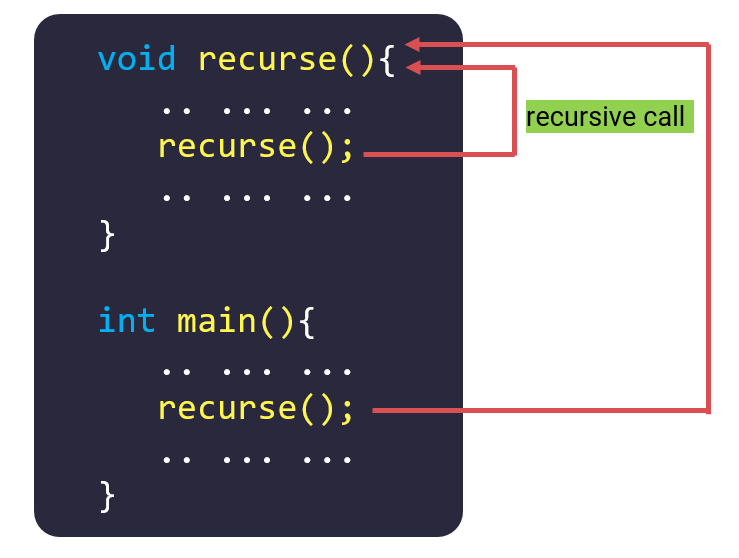

# Đệ Quy - Recursion

---

## 1. Định nghĩa

Hàm đệ quy là hàm tự gọi lại chính nó trong quá trình thực thi. Kỹ thuật này được sử dụng rộng rãi trong nhiều thuật toán và cấu trúc dữ liệu như Quick Sort, Merge Sort, DFS, hoặc Cây Phân Đoạn.



Minh hoạ:

```cpp
#include <stdio.h>

void recursive(int n){
   if (n > 0){
      printf("%d ", n);
      recursive(n - 1); // Gọi lại chính nó
   }
}

int main(){
   recursive(4);
   return 0;
}
```

Output:

```
4 3 2 1
```

---

## 2. Ví dụ về Đệ quy

Ví dụ 1: Hiểu cách hoạt động của đệ quy

```cpp
#include <stdio.h>

void dequy(int n){
   if (n > 0){
      printf("Loi goi ham khi n = %d\n", n);
      dequy(n - 1); // Gọi hàm đệ quy
   }
   printf("Ham khi n = %d ket thuc !\n", n);
}

int main(){
   dequy(4);
   return 0;
}
```

Output:

```
Loi goi ham khi n = 4
Loi goi ham khi n = 3
Loi goi ham khi n = 2
Loi goi ham khi n = 1
Ham khi n = 0 ket thuc !
Ham khi n = 1 ket thuc !
Ham khi n = 2 ket thuc !
Ham khi n = 3 ket thuc !
Ham khi n = 4 ket thuc !
```

Giải thích:

- dequy(4) được gọi trong main, hàm dequy với n = 4 được gọi, kiểm tra n > 0 nên sẽ thực hiện câu lệnh thứ 1 trong if và in ra nội dung : "Loi goi ham khi n = 4". Sau đó thực hiện câu lệnh dequy(n - 1) tương đương với dequy(3). Hàm dequy(3) sẽ chạy, dequy(4) sẽ đợi dequy(3) chạy xong để tiếp tục thực hiện câu lệnh bên dưới của if và kết thúc
- dequy(3) được chạy, kiểm tra n > 0 nên sẽ in ra nội dung "Loi goi ham khi n = 3". Sau đó xuống câu lệnh dequy(n - 1) tương đương với dequy(2).
- dequy(2) được chạy, kiểm tra n > 0 nên sẽ in ra nội dung "Loi goi ham khi n = 2". Sau đó xuống câu lệnh dequy(n - 1) tương đương với dequy(1).
- dequy(1) được chạy, kiểm tra n > 0 nên sẽ in ra nội dung "Loi goi ham khi n = 1". Sau đó xuống câu lệnh dequy(n - 1) tương đương với dequy(0).
- dequy(2) được chạy, kiểm tra n > 0 không đúng nên 2 câu lệnh trong if của hàm dequy(0) không được thực hiện mà thực hiện câu lệnh cuối cùng trong hàm dequy(0) và in ra "Ham khi n = 0 ket thuc !"
- Sau khi dequy(0) chạy xong, quay lại bước thứ 4, khi hàm dequy(1) gọi dequy(0) ở câu lệnh thứ 2 trong if, hàm dequy(0) vừa chạy xong nên câu lệnh này cũng sẽ chạy xong, hàm dequy(1) sẽ thực hiện câu lệnh cuối cùng và in ra "Ham khi n = 1 ket thuc !"
- Sau khi dequy(1) chạy xong, quay lại bước thứ 3, hàm dequy(2) gọi dequy(1) ở câu lệnh thứ 2 trong if, hàm dequy(1) vừa chạy xong nên dequy(2) cũng thực hiện câu lệnh cuối cùng và in ra "Ham khi n = 2 ket thuc !"
- Hàm dequy(2) kết thúc, ở bước 2 dequy(3) gọi dequy(2) ở câu lệnh thứ 2 trong if giờ đã chạy xong, dequy(3) cũng thực hiện câu lệnh cuối cùng và in ra "Ham khi n = 3 ket thuc !"
- Hàm dequy(3) kết thúc, ở bước 1 dequy(4) gọi dequy(3) ở câu lệnh thứ 2 trong if giờ đã chạy xong, dequy(4) cũng thực hiện câu lệnh cuối cùng và in ra "Ham khi n = 4 ket thuc !"

Ví dụ 2: Tính tổng từ 1 đến N bằng đệ quy

```cpp
#include <stdio.h>

int sum(int n){
   if (n == 0) return 0; // Điều kiện dừng
   return n + sum(n - 1); // Công thức truy hồi
}

int main(){
   printf("%d", sum(3)); // Tính tổng từ 1 đến 3
   return 0;
}
```

Output:

```
6
```

Giải thích:

- Hàm sum(3) được gọi, khi đó n = 3, nên hàm sum(3) được thực hiện câu lệnh return n + sum(n - 1) tương ứng với 3 + sum(2). Vậy thì hàm sum(3) sẽ chưa kết thúc được ngay vì nó cần phải có giá trị của sum(2) rồi mới trả về được giá trị
- Hàm sum(2) được gọi, khi đó n = 2, nên hàm sum(2) được thực hiện câu lệnh return n + sum(n - 1) tương ứng với 2 + sum(1)
- Hàm sum(1) được gọi, khi đó n = 1, nên hàm sum(1) được thực hiện câu lệnh return n + sum(n - 1) tương ứng với 1 + sum(0)
- Hàm sum(0) được gọi, khi đó n = 0 nên hàm sum(0) được return giá trị 0 và kết thúc
- Trong bước 3, sum(0) sau khi được tính xong sẽ được + thêm 1 và trả về giá trị cho hàm sum(1), vì thế sum(1) kết thúc với giá trị trả về là 1
- Trong bước 2, sum(2) được return 2 + sum(1), sum(1) vừa được tính xong bằng 1 nên sum(2) kết thúc với trả về giá trị là 2 + 1 = 3
- Trong bước 1, sum(3) được return 3 + sum(2), sum(2) vừa chạy xong và có kết quả là 3 nên sum(3) kết thúc với giá trị trả về là 3 + 3 = 6

---

## 3. Công thức truy hồi

Công thức truy hồi là công cụ quan trọng để giải bài toán bằng đệ quy. Nó mô tả cách xác định kết quả của một bài toán lớn dựa trên kết quả của bài toán con nhỏ hơn.

---

## 4. Stack Overflow

Stack Overflow hay tràn bộ nhớ ngăn xếp là một tình trạng hay xảy ra khi bạn code đệ quy, bản chất của đệ quy là sinh ra các lời gọi hàm và mỗi lần lời gọi hàm được gọi thì nó sẽ chiếm 1 chỗ trong bộ nhớ ngăn xếp.

Nếu bộ nhớ ngăn xếp không được giải phóng thì tới một lúc nào đó nó sẽ bị tràn và làm chương trình của các bạn bị dừng đột ngột.
